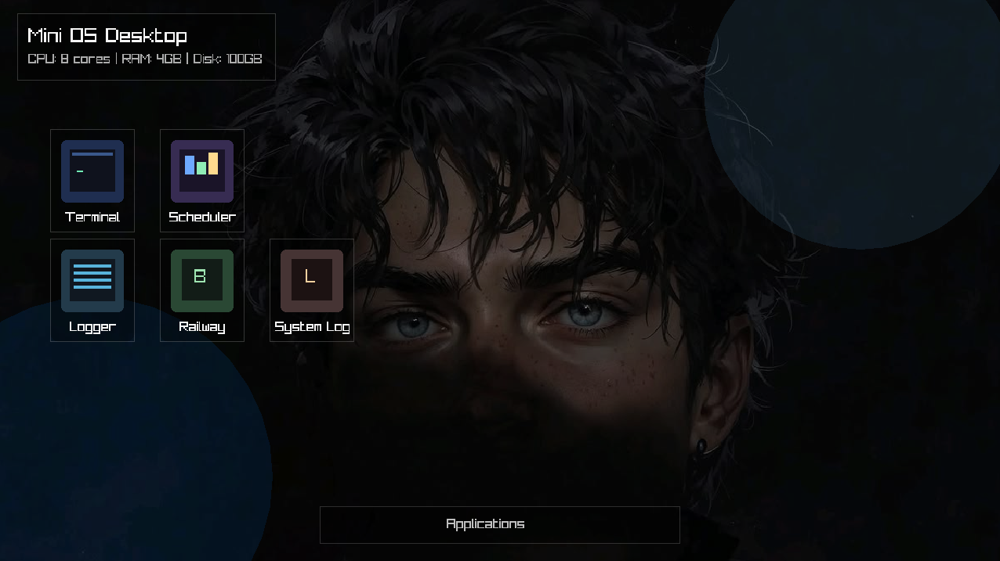
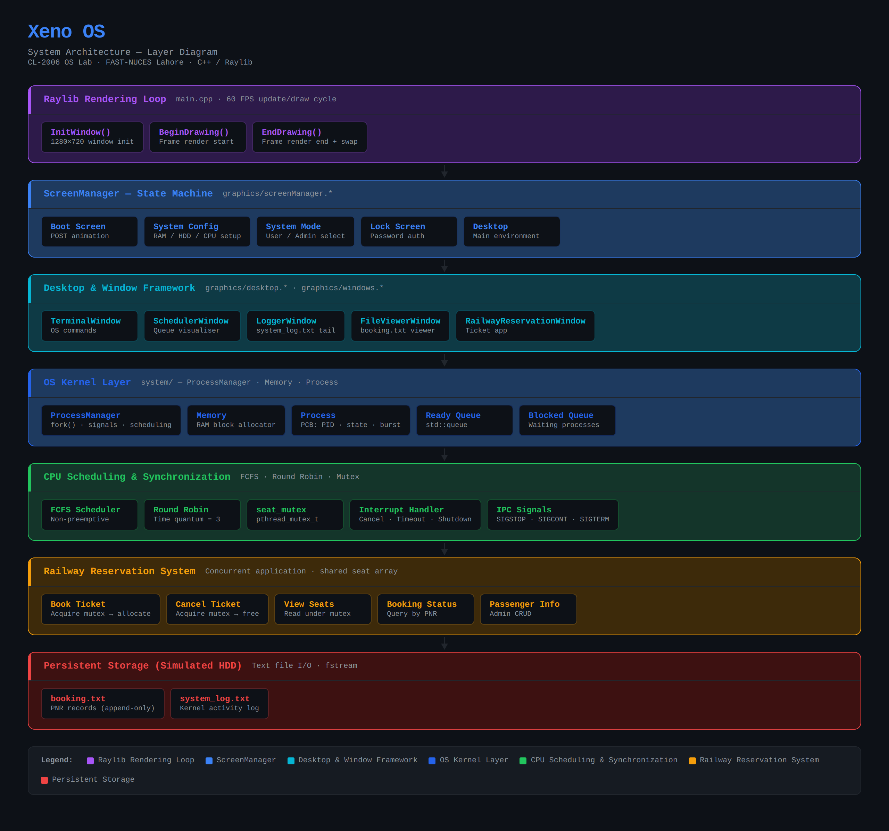
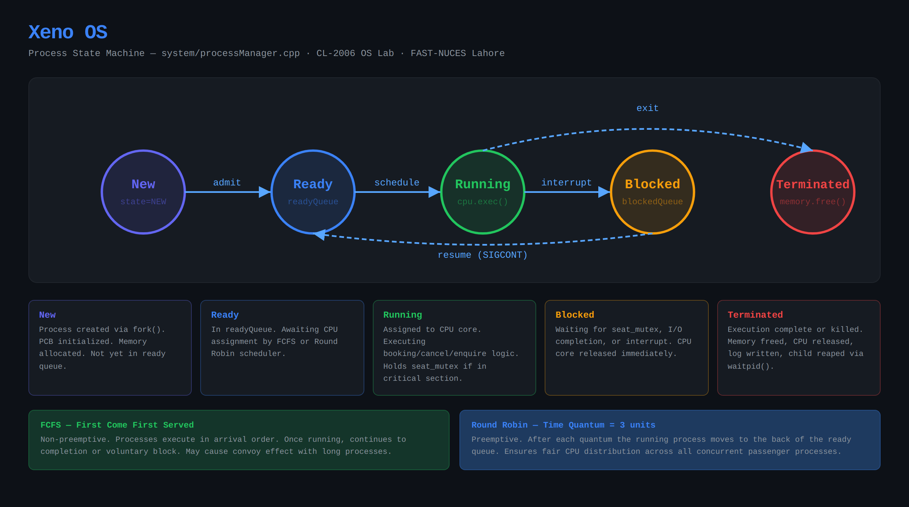
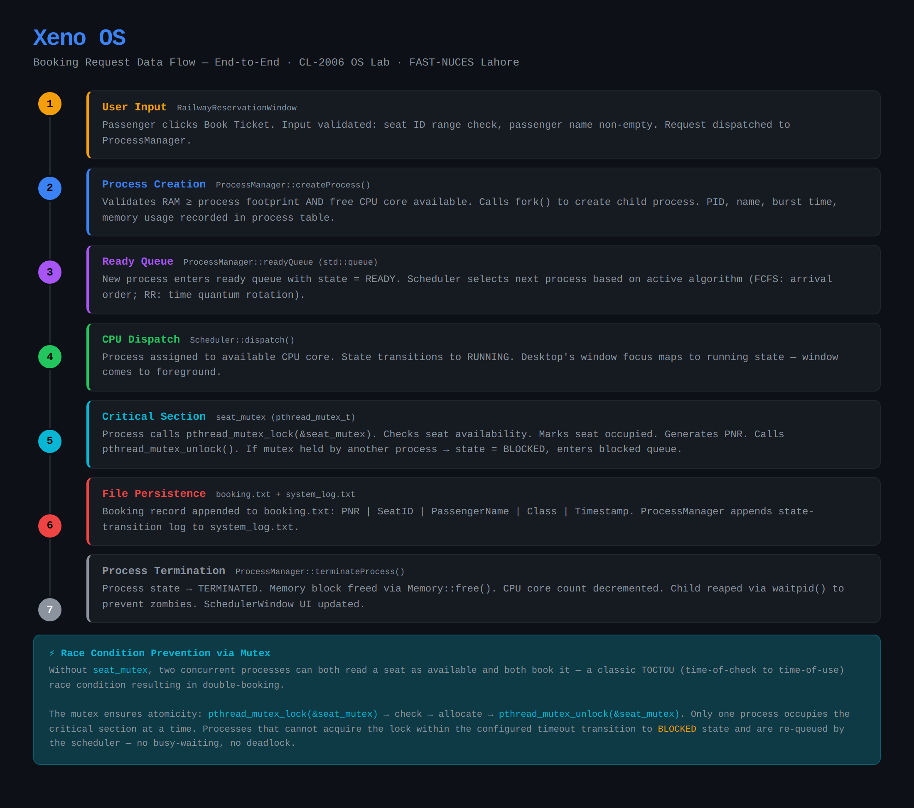

# Xeno OS — Mini Operating System Simulator



> An educational OS simulator built in **C++ + Raylib** that demonstrates process management, CPU scheduling, synchronization, and IPC through a fully graphical desktop environment — powered by a **Concurrent Railway Reservation System** as its flagship application.

<br>

## Architecture Diagrams

|                    Layer Diagram                    |                Process State Machine                 |               Booking Data Flow                |
| :-------------------------------------------------: | :--------------------------------------------------: | :--------------------------------------------: |
|  |  |  |

> ℹ Place the three architecture PNGs in a `docs/` folder for the images to render.

<br>

## -> Features

- **Animated Boot Sequence** — simulated POST, kernel load, and system initialization
- **System Configuration Screen** — configure RAM, HDD, and CPU cores before booting the desktop
- **Dual-Mode Access Control** — User Mode and Kernel (Admin) Mode with password-protected lockscreen
- **Live CPU Scheduler** — toggle between **FCFS** and **Round Robin** (quantum = 3) at runtime
- **Concurrent Process Management** — `fork()`-based process creation, 5-state lifecycle, signal-based IPC
- **Mutex Synchronization** — `pthread_mutex_t` guards the shared seat array against race conditions
- **Railway Reservation System** — book, cancel, and query tickets concurrently with full PNR tracking
- **Live System Logger** — real-time tail of `system_log.txt` inside the desktop
- **Persistent Storage** — booking records and kernel logs survive across sessions

<br>

## Architecture Overview

```
Raylib Rendering Loop (main.cpp)
        │
        ▼
ScreenManager ── Boot ── SystemConfig ── SystemMode ── LockScreen ── Desktop
        │
        ├── Memory          (RAM block allocator)
        └── ProcessManager  (fork, signals, scheduling, IPC)
                │
                ├── FCFS Scheduler
                ├── Round Robin Scheduler
                ├── seat_mutex  (pthread_mutex_t)
                └── Railway Reservation System
                        ├── booking.txt      (persistent)
                        └── system_log.txt   (persistent)
```

### Window Applications on the Desktop

| Window                     | Purpose                                                     |
| -------------------------- | ----------------------------------------------------------- |
| `RailwayReservationWindow` | Book / cancel tickets, view seat grid, query PNR            |
| `SchedulerWindow`          | Real-time ready/blocked queue visualizer + algorithm toggle |
| `LoggerWindow`             | Live tail of `system_log.txt`                               |
| `FileViewerWindow`         | Read `booking.txt`                                          |
| `TerminalWindow`           | Submit OS commands                                          |

<br>

## OS Concepts Demonstrated

### Process Management

- **5-state lifecycle**: `New → Ready → Running → Blocked → Terminated`
- `fork()` for process creation; `waitpid()` to reap zombies
- Process Control Block (PCB): PID, name, state, burst time, memory footprint

### CPU Scheduling

| Algorithm   | Type           | Behaviour                                                      |
| ----------- | -------------- | -------------------------------------------------------------- |
| FCFS        | Non-preemptive | Executes in arrival order; convoy effect possible              |
| Round Robin | Preemptive     | Time quantum = 3 units; fair distribution across all processes |

### Synchronization

```cpp
pthread_mutex_lock(&seat_mutex);
// ─── CRITICAL SECTION ───────────────────────────
if (seats[id].available) {
    seats[id].available = false;
    seats[id].passenger  = name;
    appendBooking(pnr, id, name);   // write to booking.txt
}
// ─── END CRITICAL SECTION ───────────────────────
pthread_mutex_unlock(&seat_mutex);
```

Prevents **TOCTOU race conditions** (double-bookings) when multiple passenger processes run concurrently.

### IPC via Signals

| Signal    | Meaning                               |
| --------- | ------------------------------------- |
| `SIGSTOP` | Suspend running child → Blocked state |
| `SIGCONT` | Resume blocked child → Ready state    |
| `SIGTERM` | Graceful termination                  |
| `SIGKILL` | Force-kill (admin/kernel mode only)   |

### User Mode vs Kernel Mode

|                             | User Mode | Kernel Mode |
| --------------------------- | --------- | ----------- |
| Book / cancel tickets       | ✓         | ✓           |
| View seat grid              | ✓         | ✓           |
| View `system_log.txt`       | ✗         | ✓           |
| Kill any process            | ✗         | ✓           |
| Change scheduling algorithm | ✗         | ✓           |
| Reset seat database         | ✗         | ✓           |

<br>

## Build & Run

### Prerequisites

```bash
# Ubuntu / Debian
sudo apt update
sudo apt install libraylib-dev g++ make
```

### Compile

```bash
g++ main.cpp graphics/*.cpp system/*.cpp boot/*.cpp \
    -o xeno_os \
    -lraylib -lGL -lm -lpthread -ldl -lrt -lX11
```

### Run

```bash
./xeno_os
```

> **Note for WSL users**: you'll need an X server (e.g. VcXsrv or WSLg) running and `DISPLAY` exported.

<br>

## Project Structure

```
xeno-os/
├── main.cpp                        # Entry point — Raylib loop + ScreenManager
├── graphics/
│   ├── screenManager.{h,cpp}       # Top-level FSM: Boot → Desktop
│   ├── desktop.{h,cpp}             # Desktop UI, icons, window management
│   ├── lockScreen.{h,cpp}          # Password auth + background generation
│   ├── windows.{h,cpp}             # Base draggable window class
│   └── assets/                     # Background images, icons
├── system/
│   ├── processManager.{h,cpp}      # Kernel: scheduling, fork, signals, log
│   ├── memory.{h,cpp}              # RAM block allocator
│   └── process.{h,cpp}             # Process struct / PCB
├── boot/                           # Boot animation components
├── booking.txt                     # Persistent booking records (auto-created)
├── system_log.txt                  # Persistent kernel activity log (auto-created)
└── docs/
    ├── SYSTEM_ARCHITECTURE.md
    ├── xeno_os_layer_diagram.png
    ├── xeno_os_process_states.png
    └── xeno_os_booking_flow.png
```

<br>

## Team

| Member        | Responsibilities                                                                                  |
| ------------- | ------------------------------------------------------------------------------------------------- |
| Abdul Mannan  | Boot simulation, ScreenManager FSM, ProcessManager, Memory module                                 |
| Aima Rashid   | FCFS & Round Robin schedulers, SchedulerWindow, mutex synchronization, interrupt handling         |
| Eshaal Fatima | Railway Reservation System, file persistence, LoggerWindow, FileViewerWindow, integration testing |

<br>

## Course

**CL-2006 — Operating Systems Lab**  
FAST-NUCES Lahore · Fall 2024

<br>

## License

This project was built for academic purposes at FAST-NUCES. Feel free to reference the architecture and concepts.
